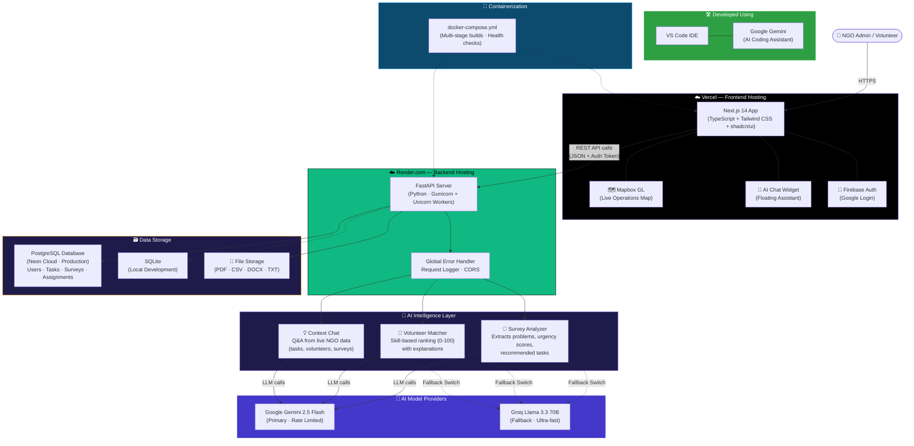

<div align="center">

<br/>


<h1>VolunteerIQ</h1>

<p><strong>AI-Powered Humanitarian Intelligence for NGOs</strong></p>

<p>
  
  
  
</p>

<p>
  
  
  
  
  
  
  
</p>

<br/>

> *"From raw community signals to coordinated field operations — in minutes."*

<br/>

</div>

---

## 🌍 What is VolunteerIQ?

**VolunteerIQ** is an AI-powered coordination platform that **transforms how NGOs respond to community crises**. During disasters, health emergencies, or humanitarian crises, NGOs are drowning in unstructured survey data while volunteers wait without direction.

VolunteerIQ bridges this gap: upload raw field surveys → Gemini AI extracts urgent problems → auto-generates actionable tasks → matches the **right volunteers** with the **right skills** to the **right locations** — all within minutes, not days.

### 🎯 The Problem We Solve

| Without VolunteerIQ | With VolunteerIQ |
|---|---|
| Manual survey analysis (days) | AI analysis in seconds |
| Volunteers assigned by gut feeling | Data-driven skill-based matching |
| No visibility into field operations | Live operations map with real-time status |
| Survey data silos, no action | Every survey becomes a deployment plan |
| Chat over phone/email | Contextual AI assistant with live NGO data |

---

## ✨ Core Features

### 🤖 AI Intelligence Layer
- **Survey Analysis Engine** — Upload CSV, PDF, DOCX, or TXT field reports. Gemini 1.5 Pro extracts top 3 urgent community problems, urgency scores (High/Medium/Low), a concise executive summary, and recommended interventions.
- **Auto Task Generation** — Each survey automatically produces 3 ready-to-launch field tasks with required skill tags, location metadata, and descriptions.
- **Smart Volunteer Matching** — For any task, AI ranks available volunteers by skill match, location proximity, and availability — with a score (0–100) and a one-sentence explanation.
- **Contextual AI Chat** — Ask plain English questions about your NGO's data ("Who can handle medical tasks in Bhubaneswar?") and get intelligent answers pulled from live DB context.
- **Dual AI Provider** — Switch between **Gemini 1.5 Pro** (primary) and **Groq Llama 3** (fallback) for all AI operations. Rate-limit-aware with graceful degradation stubs.

### 📊 Operational Command Center
- **Live Dashboard** — Real-time stats: total volunteers, active/completed/open tasks, urgent problems from latest survey, recent survey scans, and a task health progress bar.
- **Live Operations Map** — Mapbox-powered geospatial map showing all tasks as colored pins (🔴 Open · 🔵 Active · 🟢 Completed), with a legend, click popups, and geocoding cache to minimize API calls.
- **Task Management** — Create, update, filter, and delete field tasks. Full lifecycle: `open → assigned → completed`.
- **Volunteer Assignment Flow** — One-click assign/unassign from any task detail page. Task status auto-transitions on changes.

### 👥 Personnel Intelligence
- **Volunteer Profiles** — Rich profiles with skills, availability slots, location, and profile photos (via Google Auth or DiceBear avatars).
- **Smart Filtering** — Search volunteers by name, skill, or location with instant live filtering on the Volunteers page.
- **Volunteer HQ** — Animated card grid with skill badges, availability tags, and a live count of the force.

### 🔐 Security & Infrastructure
- **Google Authentication** — Firebase-backed Google Login. Token verified server-side on every protected request.
- **Protected Routes** — Auth-guarded app shell. Unauthenticated users redirect cleanly to `/login`.
- **File Processing Pipeline** — Upload handler supports PDF (pdfplumber), CSV (pandas), DOCX (python-docx), and TXT — with graceful error messages per type.
- **Demo Seed Script** — `seed_demo_data.py` populates a rich showcase dataset (volunteers, surveys, tasks, assignments) for demos.

---

## 🏗️ Architecture
**Key Tech: Google Gemini 2.5 Flash · Groq Llama 3.3 · Firebase Auth · Mapbox GL · Docker**



**Data Flow Explained:**
1. **User** (NGO Admin or Volunteer) opens the app on **Vercel** and authenticates via **Firebase Google Login**.
2. Frontend sends REST API calls with auth tokens to the **FastAPI backend** on **Render.com**.
3. **Survey Upload Flow**: User uploads a PDF/CSV/DOCX → backend extracts text → **Gemini 2.5 Flash** analyzes urgent problems, urgency scores, and auto-generates deployable field tasks.
4. **Volunteer Matching**: For any task, the AI ranks volunteers by skill match, location, and availability with a score (0–100) and explanation.
5. **Context-Aware Chat**: The floating AI assistant queries live NGO data (tasks, volunteers, surveys) to answer plain English questions.
6. **Fallback Strategy**: If Gemini hits rate limits, all AI operations seamlessly switch to **Groq Llama 3.3** for uninterrupted service.
7. **Data persists** to **PostgreSQL on Neon Cloud** (production) or **SQLite** (local development).

### Data Models

| Model | Key Fields |
|---|---|
| `User` | id, name, email, role, skills[], availability[], location, photo_url |
| `Task` | id, ngo_id, title, description, required_skills[], location, status, assigned_to[] |
| `Assignment` | id, task_id, volunteer_id, status, assigned_at |
| `Survey` | id, ngo_id, file_name, extracted_text, analysis_result (JSON) |

---

## 🛠️ Tech Stack

| Layer | Technology | Purpose |
|---|---|---|
| **Frontend** | Next.js 14, App Router | Cinematic UI, SSR, routing |
| **Styling** | Tailwind CSS, shadcn/ui | Premium component system |
| **Backend** | FastAPI (Python 3.12+) | High-performance REST API |
| **Primary AI** | Google Gemini 2.5 Flash | Survey analysis, matching, chat |
| **Fallback AI** | Groq (Llama 3.3 70B) | Ultra-fast inference fallback |
| **Auth** | Firebase Authentication | Google Login, JWT verification |
| **Database** | PostgreSQL (Neon) + SQLAlchemy | Cloud-hosted, production-grade |
| **Geo/Maps** | Mapbox GL, react-map-gl | Live operations visualization |
| **File Parsing** | pdfplumber, pandas, python-docx | Multi-format survey extraction |
| **DevOps** | Docker, Gunicorn, docker-compose | Containerized deployment |

---

## 🚀 Quick Start

### Option 1: Docker (Recommended) 🐳

```bash
git clone https://github.com/Anil-Pradhan-web/VolunteerIQ.git
cd VolunteerIQ

# Setup env files (get keys from team lead)
cp backend/.env.example backend/.env
cp frontend/.env.example frontend/.env.local

# One command launch
docker-compose up --build
```

Then open: **[http://localhost:3000](http://localhost:3000)** | API Docs: **[http://localhost:8000/docs](http://localhost:8000/docs)**

> 📖 See **[DOCKER_SETUP.md](DOCKER_SETUP.md)** for detailed Docker instructions.

---

### Option 2: One-Click Launch (Windows)

```powershell
./start.bat
```

---

### Option 3: Manual Setup

#### 2. Setup Frontend

```bash
cd frontend
npm install
```

Create `frontend/.env.local`:

```env
NEXT_PUBLIC_API_URL=http://127.0.0.1:8000

# Firebase (from Firebase Console → Project Settings)
NEXT_PUBLIC_FIREBASE_API_KEY=your_api_key
NEXT_PUBLIC_FIREBASE_AUTH_DOMAIN=your-project.firebaseapp.com
NEXT_PUBLIC_FIREBASE_PROJECT_ID=your-project-id
NEXT_PUBLIC_FIREBASE_STORAGE_BUCKET=your-project.appspot.com
NEXT_PUBLIC_FIREBASE_MESSAGING_SENDER_ID=your_sender_id
NEXT_PUBLIC_FIREBASE_APP_ID=your_app_id

# Optional — Live Operations Map (get free token at mapbox.com)
NEXT_PUBLIC_MAPBOX_TOKEN=pk.your_mapbox_token
```

#### 3. Setup Backend

```bash
cd backend
python -m venv .venv

# Activate virtual environment
.venv\Scripts\activate        # Windows
# source .venv/bin/activate   # Mac/Linux

pip install -r requirements.txt
```

Create `backend/.env`:

```env
GEMINI_API_KEY=your_gemini_api_key_from_aistudio
GEMINI_MODEL=gemini-1.5-pro

DATABASE_URL=sqlite:///./volunteeriq.db
FIREBASE_PROJECT_ID=your-project-id

CORS_ORIGINS=http://localhost:3000,http://127.0.0.1:3000
APP_HOST=127.0.0.1
APP_PORT=8000
```

> 💡 **Groq is optional.** If you set `GROQ_API_KEY=your_groq_key`, the platform will use it as a fallback. All AI features degrade gracefully with stub responses if keys are missing.

#### 4. Seed Demo Data

```bash
# From the backend directory (with venv active)
python seed_demo_data.py
```

This populates your local database with realistic volunteers, surveys, tasks, and assignments — ready for a polished demo run.

#### 5. Run the Servers

**Terminal 1 — Frontend:**
```bash
cd frontend
npm run dev
```
> Opens at **http://localhost:3000**

**Terminal 2 — Backend:**
```bash
cd backend
.venv\Scripts\activate
uvicorn main:app --reload
```
> API at **http://127.0.0.1:8000**  
> Interactive Docs at **http://127.0.0.1:8000/docs**

---

## 📁 Project Structure

```
VOLUNTEER IQ/
│
├── frontend/                         # Next.js 14 Application
│   ├── app/
│   │   ├── page.tsx                  # Landing page (hero + features + CTA)
│   │   ├── login/                    # Google Sign-In page
│   │   ├── dashboard/                # NGO Command Center
│   │   ├── upload/                   # AI Survey Intelligence page
│   │   ├── tasks/                    # Task list + /[id] detail page
│   │   ├── volunteers/               # Volunteer HQ (search + filter grid)
│   │   └── volunteer/profile/        # Profile editor (skills, availability, photo)
│   ├── components/
│   │   ├── auth/ProtectedRoute.tsx   # Auth guard wrapper
│   │   ├── chat/gemini-chat.tsx      # Floating AI assistant widget
│   │   ├── common/                   # live-map, stat-card, empty-state, etc.
│   │   ├── layout/                   # Sidebar + AppShell + Header
│   │   └── ui/                       # shadcn/ui component library
│   ├── lib/                          # Firebase config + Auth context
│   ├── Dockerfile                    # Multi-stage Next.js build
│   └── .dockerignore
│
├── backend/                          # FastAPI Python Intelligence Server
│   ├── app/
│   │   ├── config.py                 # Centralized settings from .env
│   │   ├── database.py               # SQLAlchemy engine (SQLite / PostgreSQL)
│   │   ├── db_models.py              # ORM: User, Task, Assignment, Survey
│   │   └── models.py                 # Pydantic request/response schemas
│   ├── routes/                       # 8 API route modules
│   ├── services/                     # Gemini, Groq, DB, Auth services
│   ├── main.py                       # FastAPI app + error handler + logging
│   ├── seed_demo_data.py             # Demo data seeder (SQLite + PostgreSQL)
│   ├── Dockerfile                    # Multi-stage Python build
│   └── requirements.txt
│
├── docker-compose.yml                # One-command full stack launch
├── DOCKER_SETUP.md                   # Docker setup guide for team
├── architecture.png                  # System architecture diagram
├── start.bat                         # Windows one-click launcher
├── execution_plan.md                 # Sprint plan & feature tracker
└── README.md                         # This file
```

---

## 🔌 API Reference

| Method | Endpoint | Description |
|---|---|---|
| `POST` | `/api/auth/verify` | Verify Firebase JWT → create or fetch user |
| `GET` | `/api/volunteers` | List all volunteers (filter: `?skill=` `?location=`) |
| `POST` | `/api/volunteers` | Register a new volunteer profile |
| `PUT` | `/api/volunteers/{id}` | Update volunteer profile |
| `GET` | `/api/tasks` | List tasks (filter: `?ngoId=`) |
| `POST` | `/api/tasks` | Create a new task |
| `GET` | `/api/tasks/{id}` | Fetch single task with full details |
| `PUT` | `/api/tasks/{id}` | Update task (status, skills, location) |
| `DELETE` | `/api/tasks/{id}` | Delete task and its assignments |
| `POST` | `/api/assign` | Assign volunteer to task |
| `POST` | `/api/unassign` | Remove volunteer from task |
| `GET` | `/api/assignments/{user_id}` | Get all assignments for a volunteer |
| `POST` | `/api/upload-survey` | Upload file + run AI analysis |
| `GET` | `/api/surveys/{ngo_id}` | Get all surveys for an NGO |
| `GET` | `/api/surveys/{ngo_id}/{survey_id}` | Get single survey with full analysis |
| `POST` | `/api/match-volunteers` | AI-rank volunteers for a task |
| `POST` | `/api/chat` | Contextual AI Q&A from NGO data |
| `GET` | `/api/dashboard/{ngo_id}` | Aggregate stats + map tasks |
| `GET` | `/health` | API health check |

---

## 🌐 Real-World Use Cases

### 🚨 Disaster Relief
During cyclones or floods, NGOs receive hundreds of chaotic SOS messages. VolunteerIQ structures these into urgent, geocoded tasks — mapping medical volunteers to affected zones within minutes.

### 🏥 Mobile Health Camps
Medical surveys take weeks to analyze manually. Our AI processes the data overnight to prioritize villages and match doctors with the right specializations to high-density areas.

### 📚 Education Drives
Identify community schooling gaps from survey data. Automatically match teachers proficient in local languages with temporary rural education centers.

---

## 📊 Feature Status

| Feature | Status |
|---|:---:|
| Google Login (Firebase Auth) | ✅ Complete |
| Volunteer Profile CRUD | ✅ Complete |
| Survey Upload (PDF/CSV/DOCX/TXT) | ✅ Complete |
| AI Survey Analysis (Gemini 2.5) | ✅ Complete |
| AI Survey Analysis (Groq fallback) | ✅ Complete |
| Task CRUD + Status Lifecycle | ✅ Complete |
| AI Volunteer Matching | ✅ Complete |
| Volunteer Assignment + Unassignment | ✅ Complete |
| Dashboard Stats + Problem Extract | ✅ Complete |
| Live Operations Map (Mapbox) | ✅ Complete |
| Floating AI Chat Widget | ✅ Complete |
| Demo Seed Script | ✅ Complete |
| Global Error Handling | ✅ Complete |
| PostgreSQL (Neon Cloud) | ✅ Complete |
| Docker + docker-compose | ✅ Complete |
| Production Deployment | ✅ Complete |
| Demo Video Recording | ✅ Complete |
| Project Submission | ✅ Complete |

---

## 👥 Team ClutchCode

| Member | Role |
|---|---|
| **Anil Pradhan** | Full-Stack Lead — Architecture, AI Integration, Deployment |
| **Sayak Paramanik** | Testing — End to End Test,Firebase Integration |
| **Sreejita Swain** | UI and UX  — Frontend lead, AI api keys, UI/UX |

---

## 🙏 Acknowledgements

- [Google Gemini](https://ai.google.dev/) — The AI brain powering our analysis and matching
- [Groq](https://groq.com/) — Ultra-fast inference for real-time fallback
- [Firebase](https://firebase.google.com/) — Seamless, secure authentication
- [Mapbox](https://www.mapbox.com/) — Beautiful geospatial visualization
- [Vercel](https://vercel.com/) — Frontend hosting and edge deployment

---

<div align="center">

<br/>

**Built with ❤️ for Google Solution Challenge 2026**

*Empowering NGOs with Intelligence. Coordinating Compassion at Scale.*

<br/>


&nbsp;


<br/><br/>

</div>
